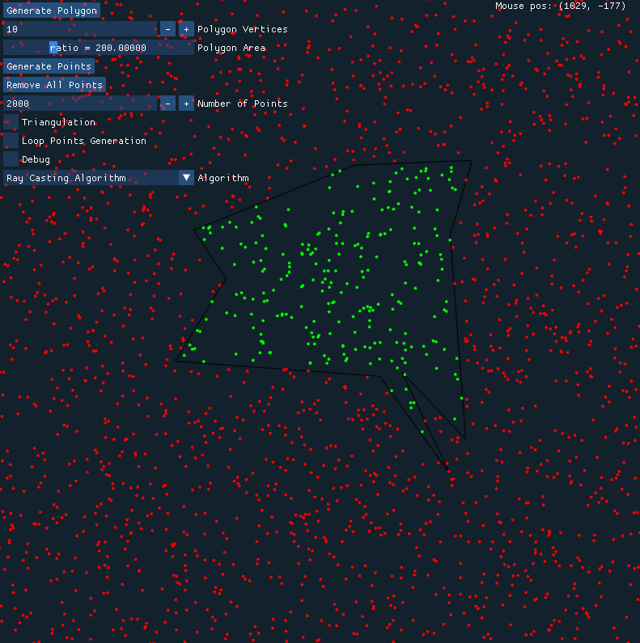

# Detection of points in simle polygon

## Features

- Generation of simple polygon
- Three algorithms to detect points in polygons
- Triangulation

## Tech

- OpenGL
- [ImGui](https://github.com/ocornut/imgui)